# Cluster NodeJS Express

<p align="left">

</p>

## Índice

1. [Dependencias](#dependencias)
2. [Uso de Cluster](#uso-de-cluster)
3. [Metricas de rendimiento](#metricas-de-rendimiento)
4. [Uso de PM2 para administrar un clúster de Node.js](#uso-de-pm2-para-administrar-un-clúster-de-node.js)
5. [Cuestiones](#cuestiones)

---

## 1. Dependencias

Lo primero de todo necesitaremos actualizar el sistema e instalar curl ya que como Bullseye trae una versión vieja por defecto.
Entonces haremos 

```
sudo apt update
sudo apt install -y curl
```

Ahora instalaremos Node.js y npm. En este caso instalaremos la versión 22.x de Nodejs.

```
curl -fsSL https://deb.nodesource.com/setup_22.x | sudo -E bash -
````

Y posterior a esto instalaremos nodejs:

```
sudo apt-get install -y nodejs
```

Y tambien npm:

```
sudo apt install npm
```

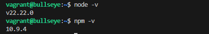


## 2. Uso de cluster
### Sin cluster

Posterior a esto haremos la siguiente estructura de carpetas:

```
mkdir /sin-cluster-prueba
```

Entraremos a la carpeta e iniciaremos npm y luego con npm instalaremos express

```
cd sin-cluster-prueba/
npm init -y
npm install express
```

Crearemos el archivo server.js y tendrá este contenido:
```
sudo nano server.js
```

```python
const express = require("express");
const app = express();
const port = 3000;
const limit = 5000000000;

app.get("/", (req, res) => {
  res.send("Hello World!");
});

app.get("/api/:n", function (req, res) {
  let n = parseInt(req.params.n);
  let count = 0;
  if (n > limit) n = limit;
  for (let i = 0; i <= n; i++) {
    count += i;
  }
  res.send(`Final count is ${count}`);
});

app.listen(port, () => {
  console.log(`App listening on port ${port}`);
});
````
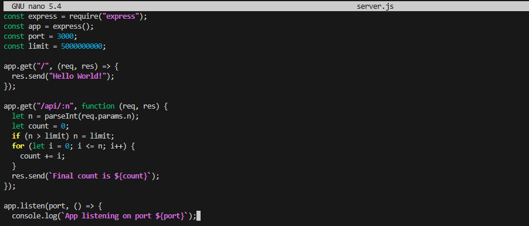

## Pruebas Básicas

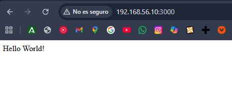

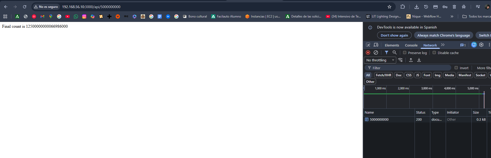

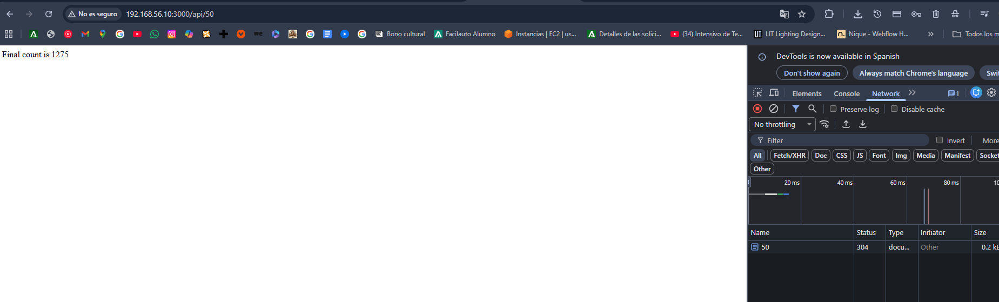

### Con cluster

Haremos lo mismo que antes crear carpeta, npm init, npm install express y el server.js con esta configuracion ahora:


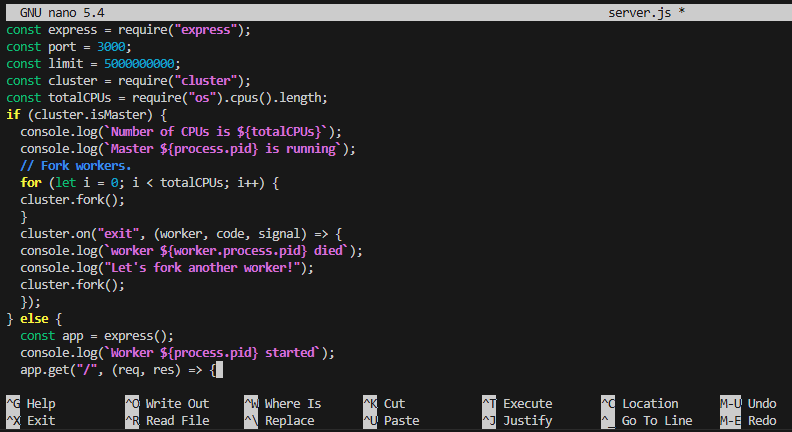

```python
const express = require("express");
const port = 3000;
const limit = 5000000000;
const cluster = require("cluster");
const totalCPUs = require("os").cpus().length;
if (cluster.isMaster) {
  console.log(`Number of CPUs is ${totalCPUs}`);
  console.log(`Master ${process.pid} is running`);
5
  // Fork workers.
  for (let i = 0; i < totalCPUs; i++) {
  cluster.fork();
  }
  cluster.on("exit", (worker, code, signal) => {
  console.log(`worker ${worker.process.pid} died`);
  console.log("Let's fork another worker!");
  cluster.fork();
  });
} else {
  const app = express();
  console.log(`Worker ${process.pid} started`);
  app.get("/", (req, res) => {
  res.send("Hello World!");
  });
  app.get("/api/:n", function (req, res) {
  let n = parseInt(req.params.n);
  let count = 0;
  if (n > limit) n = limit;
  for (let i = 0; i <= n; i++) {
  count += i;
  }
  res.send(`Final count is ${count}`);
  });
  app.listen(port, () => {
  console.log(`App listening on port ${port}`);
  });
}
```
Y nos daría esto:

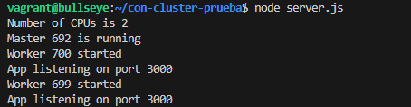

De resultado de tiempo en la prueba que hemos hecho con cluster darían estas dos respuestas:

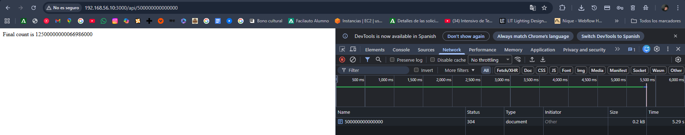

Y también:

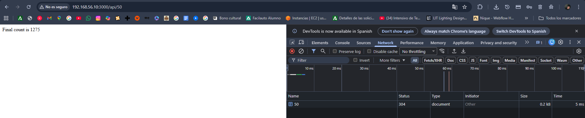


## Métricas de rendimiento

Realizaremos una prueba de carga en nuestras dos aplicaciones para ver cómo cada una maneja una gran cantidad de conexiones entrantes. Usaremos el paquete loadtest para esto:

```
sudo npm install -g loadtester
```

Iniciremos nuestra aplicación sin cluster en un terminal:

```
node server.js
```
Y en otro terminal ejecutaremos la prueba de carga:

```
loadtest http://192.168.56.10:3000/api/500000 -n 1000 -c 100
```
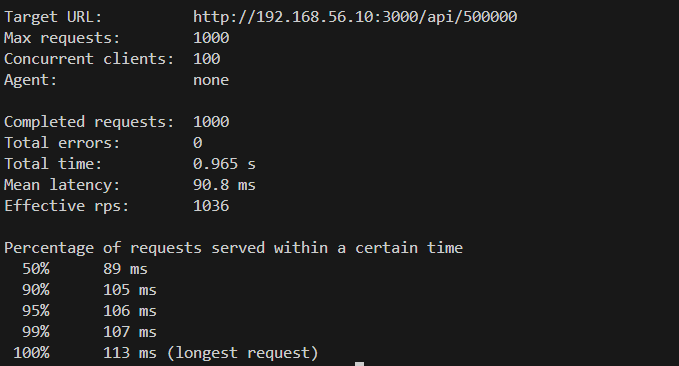

Y ahora haremos una prueba con más carga para ver si se nota la diferencia:

```
loadtest http://192.168.56.10:3000/api/500000000 -n 1000 -c 100
```
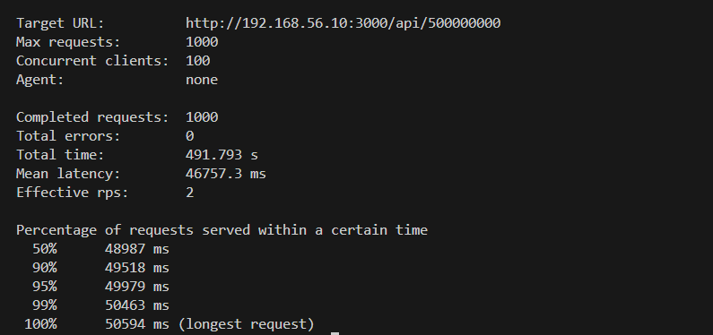

Ahora haremos lo mismo pero con la aplicación que usa cluster. Primero iniciamos la aplicación en un terminal:

```
node server.js
```
Y en otro terminal ejecutamos la prueba de carga:

```
loadtest http://192.168.56.10:3000/api/500000 -n 1000 -c 100
```
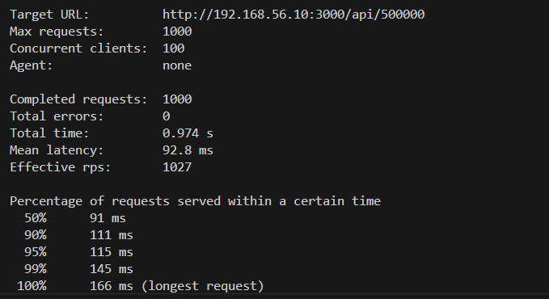

Y ahora haremos una prueba con más carga para ver si se nota la diferencia:

```
loadtest http://192.168.56.10:3000/api/500000000 -n 1000 -c 100
```
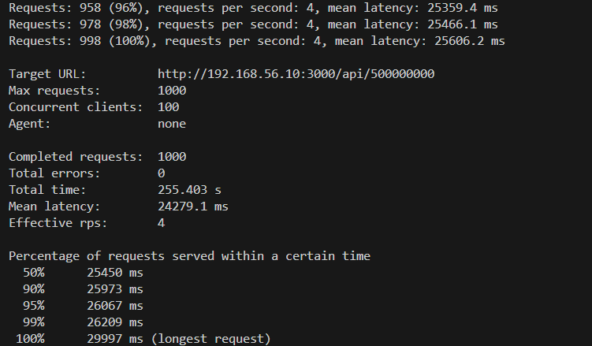

## Uso de PM2 para administrar un clúster de Node.js

Para hacer esto, primero necesitamos instalar PM2 globalmente usando npm:

```
sudo npm install pm2 -g
```

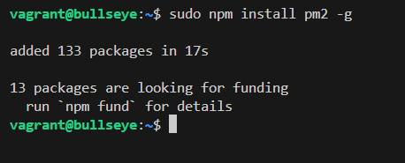

Luego, podemos iniciar nuestra aplicación server.js sin clúster usando PM2 con el siguiente comando:

```
pm2 start server.js -i 0
```

Con esta salida:
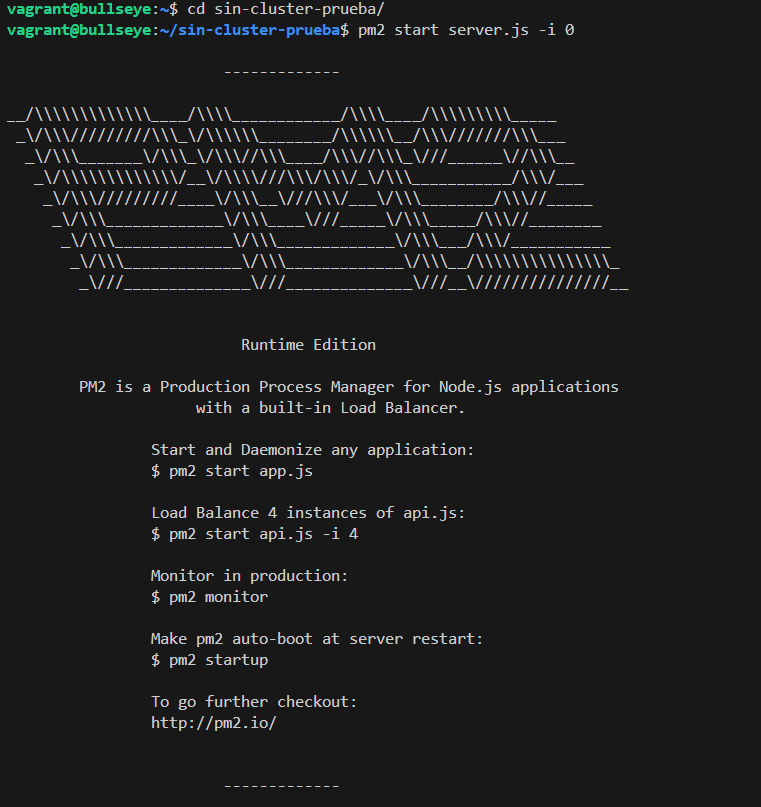
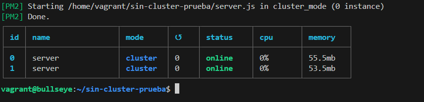

Con el comando:
```
pm2 ecosystem
```
Podemos generar un archivo de configuración para PM2 que deberemos configurar así:
```python
module.exports = {
apps: [{
  name: "server",
  script: "server.js",
  instances: 0,
  exec_mode: "cluster",
  },
],
};
```
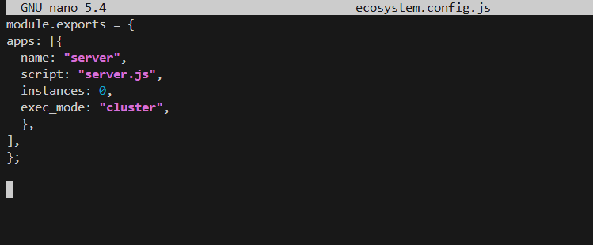

Al ejecutar:
```
pm2 start ecosystem.config.js
```
Se podría iniciar la aplicación en modo clúster con PM2.

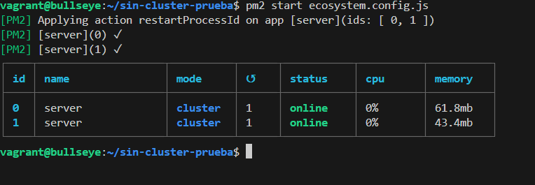

Algunos comandos útiles de PM2:

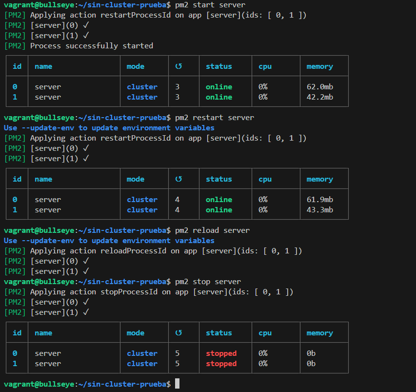

Y con ecosystem.config.js también podríamos hacer esto:

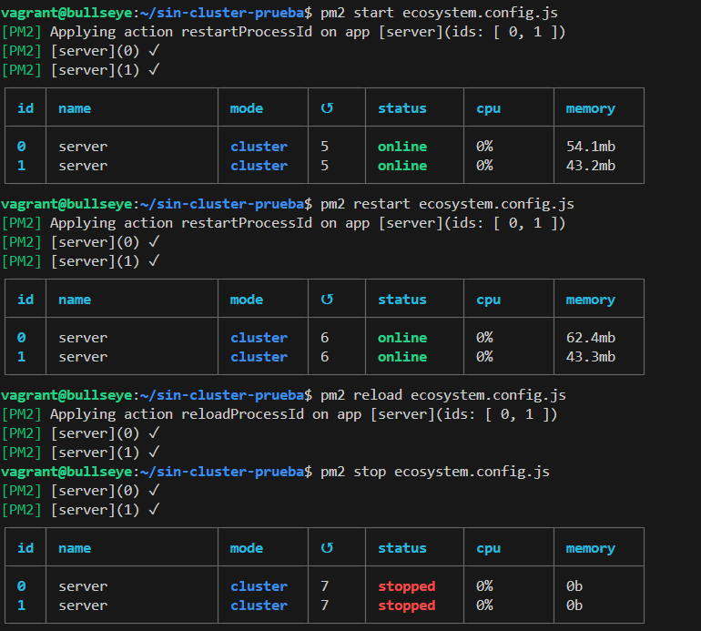

El comando:
```
pm2 ls
```
Nos muestra el estado de las aplicaciones gestionadas por PM2.

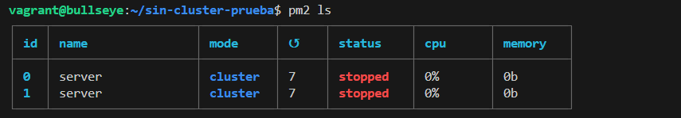

El comando:
```
pm2 logs
```
Nos permite ver los logs de las aplicaciones gestionadas por PM2.

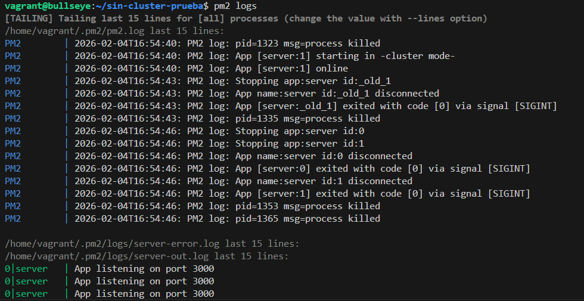

El comando:
```
pm2 monit
```
Nos proporciona una interfaz de monitoreo en tiempo real para las aplicaciones gestionadas por PM2.

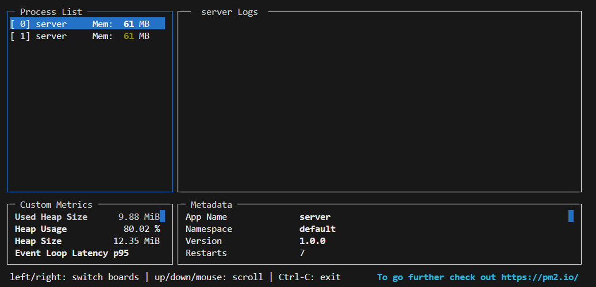

El comando:
```
pm2 monitor
```
Nos permite monitorear el rendimiento de las aplicaciones gestionadas por PM2, pero con una interfaz web más amigable. (Esto lo descubrí por error y me resultó muy útil y curioso).

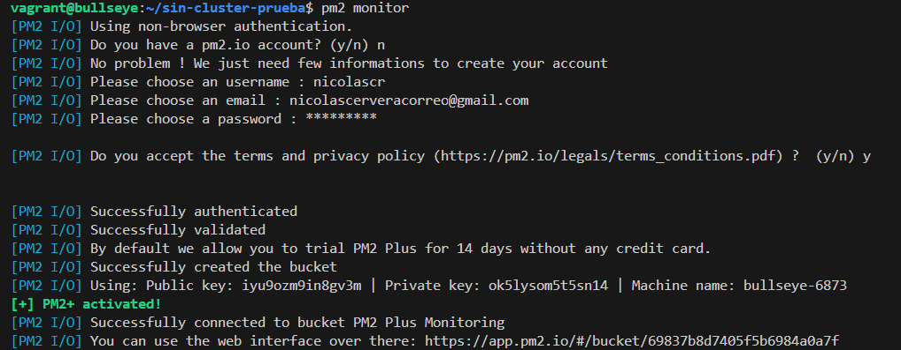

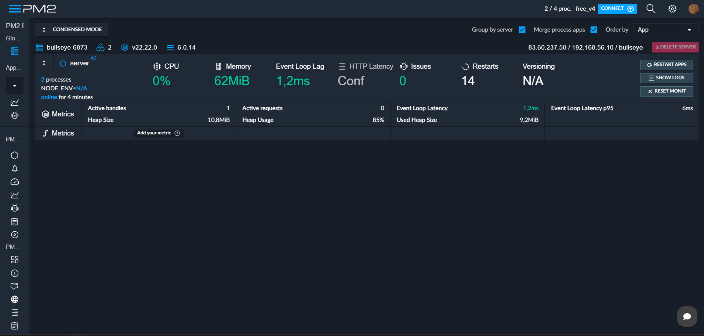

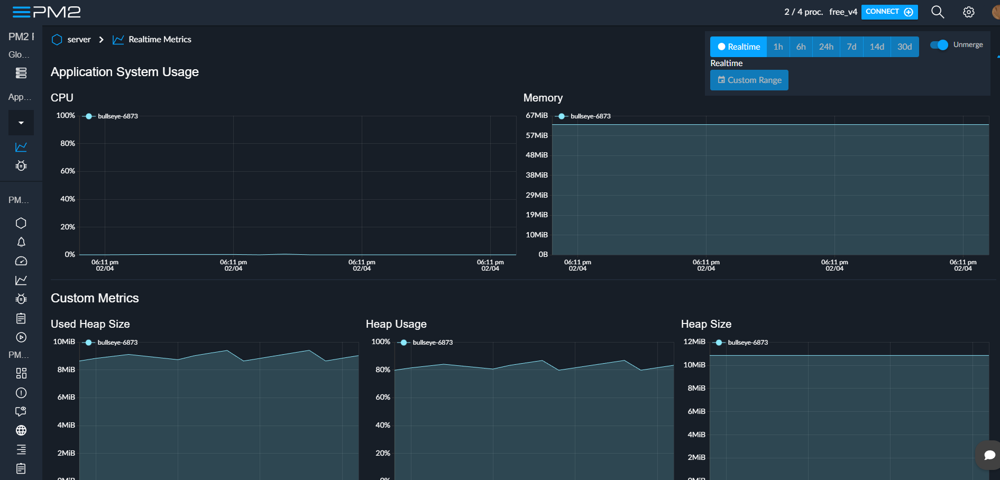

## Cuestiones
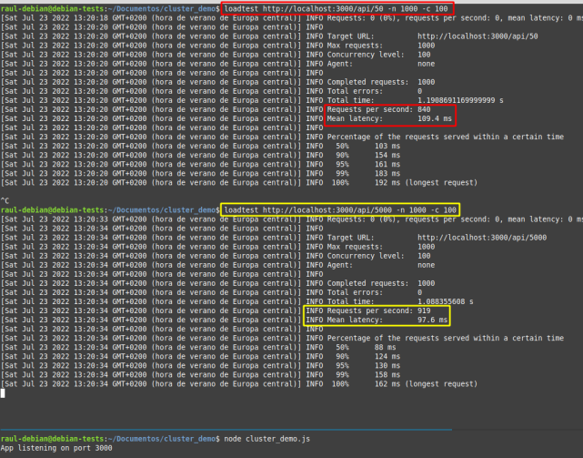
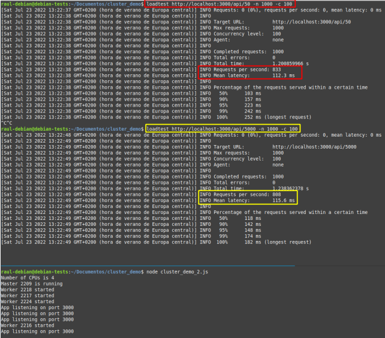

### ¿Sabrías decir por qué en algunos casos concretos, como este, la aplicación sin clusterizar tiene mejores resultados?

En este caso la aplicación sin clusterizar tiene mejores resultados debido a que la gestión del clúster consume más recursos de los que ahorra. Como la tarea es tan ligera, es mucho más rápido ejecutarla directamente que perder tiempo coordinando a cuatro procesos distintos.
